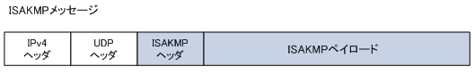
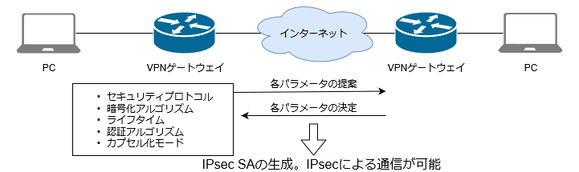

# packet_tracer_vpn
## About
Cisco Packet Tracer を使って IPsec VPN を構築するチュートリアルです。

## 準備
Cisco Packet Tracer 6.3 以上 (2019年6月14日現在の最新は7.2.1)

## 1. VPN
### 1.1. VPNの概要
参考 https://www.infraexpert.com/study/study10.html  
VPN (Virtual Private Nework )とは、仮想的なプライベートネットワーク接続のことです。VPNにより
インターネットなどの公衆網を利用する場合でも、IPsec等の高度なセキュリティを実装させられるので、
安全に企業の拠点間通信を実現できます。また、安価なFTTHの広帯域な回線をWANとして利用できます。
### 1.2. VPNの種類
VPNはインターネットVPNとIP-VPNの大きく2つに分類できます。インターネットVPNはインターネット
などの公衆網を利用したVPNのことです。IP-VPNとは、通信事業者が提供するクローズド (閉じれらた )
IPネットワークを利用したVPNのこと。インターネットVPNは正確には2種類があります。セキュリティ
プロトコルにIPsecを使用したIPsec-VPNと、セキュリティプロトコルにSSLを使用した SSL-VPN です。
IP-VPNは、MPLS-VPN のことであり、プライベートIP網内の経路情報の探索にMPLSを採用しています。

| IPsecプロトコル | 役割 | プロトコル種別 |
| ---- | ---- | ---- |
| インターネットVPN | IPsec-VPN | セキュリティプロトコルにIPsecを使用したインターネットを利用したVPNのこと |
| インターネットVPN | SSL-VPN | セキュリティプロトコルにSSLを使用したインターネットを利用したVPNのこと |
| IP-VPN | MPLS-VPN | 通信事業者のプライベートIP網内で経路情報の探索にMPLSを採用したVPNのこと |

### 1.3. VPNを支える技術
VPN接続は、鍵管理、暗号化、ハッシュ関数、認証によって実現されます。
1. **鍵管理方式**  
IPsecでは Diffie-Hellman (DH) を採用しています。これは暗号鍵を安全に手渡すために使用します。
1. **暗号化方式**  
共通鍵暗号と公開鍵暗号の2つがあります。データを暗号化するために使用します。  
共通鍵暗号(RC4, DES, 3DES, AES)  
公開鍵暗号(RSA)  
チュートリアルではAESを使用します。
1. **ハッシュ関数**  
MD5とSHAなどがあります。認証技術と併用して使用します。  
チュートリアルではSHAを使用します。
1. **認証方式**  
HMAC ( Keyed-Hashing for Message Authentication Code  )とデジタル署名があり、HMACは共通鍵を使用し、デジタル署名は公開鍵を使用します。HMACとはハッシュ関数と共通鍵を組み合わせて計算するMACのことです。  
チュートリアルではSHAを使用したHMACを使用します。

## 2. Security Architecture for IP (IPsec)
### 2.1. IPsecの概要
IPsecは、暗号化システムの技術によりネットワーク層にて、データのセキュリティを保護するのに使用されるプロトコルです。 IPsecには  
- Authentication Header (AH)
- Encapsulated Security Payload (ESP)  
の２つのプロトコルがあります。

| VPNの分類 | 役割 | プロトコル種別 |
| ---- | ---- | ---- |
| AH | パケットが改ざんされていないかどうか認証を行う。(HMAC)<br>パケットの暗号化はできない。 | IPプロトコル番号 51 |
| ESP | パケットが改ざんされていないかどうか認証を行う。(HMAC)<br>パケットのペイロード部の暗号化 ( DES or 3DES or AES ) を行う。 | IPプロトコル番号 50 |

RFC2406とRFC4303形式のESPには認証トレーラ機能があるので、通常はAHを併用せず、ESPのみを使用します。

### 2.2. IPsecの通信モード
IPsecにおける通信モードには、トランスポートモードとトンネルモードの2つのモードがあります。
- トランスポートモード: IPsecが実装されたホスト間でのIPsec-VPN
- トンネルモード: IPsecが実装されたルータ間でのIPsec-VPN  
IPsecによる通信はトンネルモードを利用していることが多いと言えます。トンネルモードにおけるIPsecが実装されたルータのことをVPNゲートウェイと呼びます。

## 3. IPsec VPN
### 3.1. Internet Key Exchange (IKE)
ここからIPsec-VPNの流れを説明します。IPsec-VPNはVPNゲートウェイ間でコネクションを確立することで達成されます。このコネクションのことをSecurity Association (SA) と呼びます。IPsecの全ての通信はこのSAを使用する事になります。このSAを自動的に生成、管理、更新することを可能にしたのがIKEです。認証用のセッション鍵 (HMAC) と暗号化用のセッション鍵のこれら両方の鍵の生成、交換、更新がIKEにより自動で行われます。IKEによるSAの生成はphase 1 とphase 2 のステップがあります。phase 1 では各種パラメータを交換しISAKMP SAを生成します。phase 2 ではそのISAKMP SA上で各種パラメータを交換してIPsec SAを生成します。  
ISAKMP = Internet Security Association and Key Management Protocol  
### 3.2. ISAKMPメッセージのフォーマット
ISAKMPメッセージは、IKE phase 1 、phase 2 のメッセージ交換の際に送受信されます。このメッセージはISAKMPヘッダとISAKMPペイロードで構成され、送信元、宛先ともUDPポート500を使用して伝送します。
  
これはIPsec-VPNの通信を確立するための全ての始まりとなるパケットです。

### 3.3. IKE phase 1
IKE phase 1 では、ネゴシエーションによりISAKMP SAに必要な以下のパラメータを決定します。

| IKE phase 1 のパラメータ | 説明 |
| ---- | ---- |
| 暗号化アルゴリズム | ISAKMPメッセージのための暗号化 ( DES or 3DES or AES ) |
| ハッシュアルゴリズム | ISAKMPメッセージのための認証と鍵計算に使用するハッシュ方式 ( MD5 or SHA-1 ) |
| ライフタイム | ISAKMP SAのライフタイムとライフタイプ (単位：秒など) |
| 認証方式 | IPsecのピアをはる相手の機器の認証方式。4つの方式がある。<br> Pre-Shared Key、デジタル署名、公開鍵暗号、改良型公開鍵暗号 |
| DHグループ | 鍵計算のためのパラメータ。DHグループ1 or 2 or 5。鍵計算に使用する値は<br>暗号化されていないがDiffie-Hellmanのアルゴリズムを使用しているため問題ない |

IKEフェーズ1では、通信相手 (IPsec機器 )との認証を行うために4つの認証方式があります。

| IKE phase 1 の相手認証方式 | 説明 |
| ---- | ---- |
| Pre-Shared Key | IPsecのピアをはる両方の機器であらかじめ同じ鍵 (事前共有鍵) を共有<br>しておく方法。この方式では、予め両方の機器で同じ文字列の鍵を設定して<br>おく必要がある。この事前共有鍵はパスフレーズとも呼ばれる。 |
| デジタル署名 | DSA と RSA の2つの方式があるが、実際に使用されているのは RSA による<br>デジタル署名方式のみ。RSAではハッシュ関数によりデータからダイジェスト<br>を生成して、それを自身の秘密鍵を使用して暗号化したデジタル署名をもとの<br>データと一緒に送信する。受信側は送信側の公開鍵で複合してダイジェストを<br>取り出し、自身で生成したダイジェストと比較することで改ざんを確認できる。 |
| 公開鍵暗号 | もとのデータの暗号化するためには、データの送信者は受信者が公開して<br>いる公開鍵を使用する。一方、受信者は暗号化されたデータを受信者だけが<br>持つ秘密鍵を使用して復号化する。これを利用して通信相手の機器を認証する。 |
| 改良型公開鍵暗号 | 公開鍵暗号を改良した方式であり、公開鍵暗号よりも計算量が少ない方式。 |

  

### 3.4. IKE phase 2
IKE フェーズ2では、ネゴシエーションによりIPsec SAに必要な以下のパラメータを決定します。

| IKE phase 2 のパラメータ | 説明 |
| ---- | ---- |
| セキュリティプロトコル | IPsecで使用するセキュリティプロトコル ( AH or ESP ) |
| 暗号化アルゴリズム | IPsecで使用する暗号化方式 ( DES or 3DES or AES ) |
| 認証アルゴリズム | IPsecで使用する認証方式 ( HMAC-MD5 or HMAC-SHA1 ) |
| ライフタイム | IPsec SAのライフタイムとライフタイプ ( 単位：秒など ) |
| カプセル化モード | トンネルモード or トランスポートモード |
| DHグループ | フェーズ2では必須ではない。共通鍵の生成に際してよりセキュアに<br>行うためにPFSと呼ばれる機能を使用する場合のみフェーズ1と同様に<br>ネゴシエーションによりDHグループを決定する必要がある。 |

  

## 4. 演習
ここまで説明してきたIPsec VPNを、Cisco Packet Tracerを用いてシミュレートします。
### 4.1. Cisco IOS
演習では、Ciscoルータ上でコマンドを入力して設定を行います。CiscoルータはCisco Internetwork Operating System (Cisco IOS)を搭載しており、大きくUser Exec Mode, Privileged Exec Mode, Global Configuration Modeの3つのModeがあります。

  

| モード | 説明 |
| ---- | ---- |
| User Exec Mode | 基本的なコマンドのみ使用可能なモード |
| Privileged Exec Mode | すべてのルータコマンドにアクセス可能なモード |
| Global Configuration Mode | グローバルな設定を行うためのモード |
| Specific Configuration Mode | 特定のインタフェースやコントローラを設定するモード |

自分が今何のモードなのかは、コマンドを入力するところの左側に示されています。例えば"Router>"ならUser Exec Mode、 "Router#"ならPrivileged Exec Modeになっています。
<br>
<br>
IOSでは'?'を入力すると実行可能なコマンド一覧が表示されます。これはコマンドの途中で入力すると、そこまで入力した文字列から可能なコマンドを列挙してくれたり、オプションの一覧を入手することもできる便利な記号です。コマンドを忘れたら'?'を使いましょう。(BashのTab補完に近い。)
<br>
<br>
Cisco Packet Tracerを起動し、ルータ1941を配置して上記のコマンドを試してみよう。ルータをクリックし、"CLI"タブをクリックするとCLIに入ることができます。

### 4.2. 演習の流れ
やっとここまで来ました。演習は以下のステップで進みます。
1. 各マシンの配置と設定
1. ルータのセキュリティライセンスを有効化
1. IKE phase 1 の設定
1. IKE phase 2 の設定
1. 疎通テスト


### 4.3. 各マシンの配置と設定  
  

| マシンの種類 | 名前 | 設定 |
| ---- | ---- | ---- |
| 1941(ルータ) | ISP | R1側:209.165.100.2<br>R3側:209.165.200.2 |
| 1941(ルータ) | R1 | ISP側:209.165.100.1<br>PC-A側:192.168.1.1 |
| 1941(ルータ) | R3 | ISP側:209.165.200.1<br>PC-C側:192.168.3.1 |
| 2960(スイッチ) | any | ---- |
| 2960(スイッチ) | any | ---- |
| PC | PC-A | 192.168.1.10 |
| PC | PC-B | 192.168.3.10 |

- ISP  
Global Configuration Modeで以下のコマンドを入力

```
!!Enter Specific Configuration Mode 
interface g0/1

!!Configure IP address
ip address 209.165.200.2 255.255.255.0

!!Bring up interface
no shut

!!Enter Specific Configuration Mode 
interface g0/0

!!Configure IP address
ip address 209.165.100.2 255.255.255.0

!!Bring up interface
no shut

!!Back to Global Configuration Mode
exit
```

- R1
Global Configuration Modeで以下のコマンドを入力

```
!!Configure machine name
hostname R1
!!Enter Specific Configuration Mode 
interface g0/1
!!Configure IP address
ip address 192.168.1.1 255.255.255.0
!!Bring up interface
no shut
!!Enter Specific Configuration Mode 
interface g0/0
!!Configure IP address
ip address 209.165.100.1 255.255.255.0
!!Bring up interface
no shut
!!Back to Global Configuration Mode
exit
!!Configure default route
ip route 0.0.0.0 0.0.0.0 209.165.100.2
```

- R3  
R1のコマンドを見ながら入力してみよう。

- PC-A, PC-C  
アイコンをクリック、"Config"タブの"FastEthernet0"をクリックし、IPアドレスを入力。  
"Config"タブの"Settings"内にあるGatewayにも適切なIPアドレスを入力。

### 4.4. ルータのセキュリティライセンスを有効化
Cisco IOSでは、基本的なIP機能に加えて高度なIP機能やIPセキュリティ機能を使用するには別途ライセンスを購入する必要があります。(購入時に付属しているライセンスもあるらしい。) IPsecを有効化するには対応するライセンスを取得してテクノロジーパッケージを有効化する必要があります。Cisco Packet TracerにはすでにIPsec用のライセンスがあります。
<br>
<br>
現在有効なライセンスを確認しましょう。Privileged Exec Modeで`show version`と入力すると、最下部に下の図のような出力が見えるはずです。

  

ライセンスを有効化させるコマンドは以下のとおりです。

```
(config)# license boot module [module-name] technology-package [package-name]
```

R1, R3でGlobal Configuration Modeで以下のコマンドを入力しパッケージを有効化させよう。

```
license boot module c1900 technology-package securityk9
```

起動時に有効になるように設定を上書きします。

```
copy run start
```

再起動します。
```
reload
```

再度`show version`コマンドで"security"行にパッケージが現れることを確認しましょう。

### 4.5. IKE phase 1 の設定
IPsecによる通信を行うためには、先ず、ISAKMP SAを生成するための設定が必要になります。IKE phase 1のポリシーを定義するために、ISAKMP Configuration Modeに入ります。以下はR1の設定。<br>

```
crypto isakmp policy 10
```

ここの`10`はpriorityを示しており、1から10000までを指定することができます。低いほど優先度が高い。<br>
<br>
次に暗号化方式、認証方式、DHのビット係数(数値が大きいほど解読に時間がかかる)を指定します。ハッシュアルゴリズムはデフォルトで"sha"なので無視しています。<br>

```
encryption aes 256
authentication pre-share
group 5
```

次に、認証方式に`pre-share`を指定した場合、そのパスワードを設定します。以下の`[password]`を好きな文字列に変えてください。`address`にはIPsecのピア(R3)のIPアドレスを指定します。

```
crypto isakmp key [password] address 209.165.200.1
```

R3にも同様の設定をしてください。

### 4.6. IKE phase 2 の設定
IKE phase 2の設定では、生成されたISAKMP SA上でIPsec SAを生成するための設定が必要になります。IPsec SAを確立させるためには、セキュリティプロトコル、暗号化アルゴリズム、認証アルゴリズムのセット（トランスフォームセットと言う）を指定します。コマンドは以下のとおりです。

```
(config)# crypto ipsec transform-set [name] [transform1] [transform2]
```

まずR1で設定を行います。今回は`[name]`に`R1-R3`、`[transform1]`に`esp-aes 256`、`[transform2]`に`esp-sha-hmac`を指定します。

```
crypto ipsec transform-set R1-R3 esp-aes 256 esp-sha-hmac
```

<br>
次にどのトラフィックをIPsecの対象トラフィックとするのかを定義します。これをアクセスリスト (ACL) と呼び、以下のコマンドで定義します。

```
(config)# access-list [number] [permit|deny] [protocol] [source] [wildcard] [dest] [wildcard]
```

| コマンド引数 | 説明 |
| ---- | ---- |
| number | 拡張ACLの番号を100〜199の範囲で指定する |
| permit or deny | 条件に合致したパケットを許可するか、拒否するかを決定する |
| protocol | プロトコルの指定 (ip, icmp, tcp, udp など) |
| source | 送信元IPアドレス |
| dest | 宛先IPアドレス |
| wildcard | ワイルドカードマスクの指定 |

R1では今回の環境では以下のコマンドになります。

```
access-list 100 permit ip 192.168.1.0 0.0.0.255 192.168.3.0 0.0.0.255
```

<br>
最後に、設定した「トランスフォームセット」と「暗号化対象のACL」をまとめたセット、「暗号マップ」を作成します。
以下のコマンドで暗号マップ名`IPSEC-MAP`、トランスフォームセット`R1-R3`、ACL番号`100`の暗号マップを作成します。

```
!!Create crypto map name of "IPSEC-MAP", with priority of 10
crypto map IPSEC-MAP 10 ipsec-isakmp
set peer 209.165.200.1
set pfs group5
set security-association lifetime seconds 86400
set transform-set R1-R3
match address 100
```

設定した暗号マップを特定のインタフェースに設定します。

```
interface GigabitEthernet0/0
crypto map IPSEC-MAP
```

以上でR1の設定が終わりました。4.6.の設定をR3にも設定しましょう。(IP アドレスの設定が若干異なります。)

### 4.7. 疎通テスト
ヒュー！ついに設定が終わりました。PC-AからPC-CにICMPパケットを送信してみましょう。(ping)

1. 画面右下の"Simulation"ボタンをクリックすると"Simulation Panel"が出現します。
1. "Show All/None"ボタンを押すたびにフィルターが切り替わります。Noneにします。
1. "Edit Filters"をクリックし、"ICMP"をクリックします。
1. 画面左上の手紙のアイコンをクリックし、PC-A, PC-Cの順にクリックするとパケットの送信元と宛先を指定することができます。
1. "Simulation Panel"にある再生ボタンを押すとパケットが送信されます。

"Simulation Panel"に、各マシンを通過した時点でのパケットが順次表示されます。PC-Aが属するLAN内のパケットと、ISPを通過するパケットの中身を比較し、IPヘッダーがESPヘッダーと新しいIPヘッダーによってカプセル化されていることを確かめましょう。
<br>
"Simulation Panel"のパケットを削除したいときは、画面右下(本当に右下)の三角形アイコンをクリックすると、自分がセットしたパケットの一覧が出てくるので、"Delete"をクリックします。<br>
<br>
以上で演習終わり！

### 4.8. Appendix

#### R1に入力したコマンド
基本設定

```
hostname R1
interface g0/1
ip address 192.168.1.1 255.255.255.0
no shut
interface g0/0
ip address 209.165.100.1 255.255.255.0
no shut
exit
ip route 0.0.0.0 0.0.0.0 209.165.100.2
```

ライセンス有効化

```
license boot module c1900 technology-package securityk9
```

IKE phase 1 and 2

```
crypto isakmp policy 10
encryption aes 256
authentication pre-share
group 5
!
crypto isakmp key secretkey address 209.165.200.1
!
crypto ipsec transform-set R1-R3 esp-aes 256 esp-sha-hmac
!
access-list 100 permit ip 192.168.1.0 0.0.0.255 192.168.3.0 0.0.0.255
!
crypto map IPSEC-MAP 10 ipsec-isakmp 
set peer 209.165.200.1
set pfs group5
set security-association lifetime seconds 86400
set transform-set R1-R3 
match address 100
!
interface GigabitEthernet0/0
crypto map IPSEC-MAP
```
#### R3に入力したコマンド
基本設定

```
hostname R3
interface g0/1
ip address 192.168.3.1 255.255.255.0
no shut
interface g0/0
ip address 209.165.200.1 255.255.255.0
no shut
exit
ip route 0.0.0.0 0.0.0.0 209.165.200.2
```

ライセンス有効化

```
license boot module c1900 technology-package securityk9
```

IKE phase 1 and 2

```
crypto isakmp policy 10
encryption aes 256
authentication pre-share
group 5
!
crypto isakmp key secretkey address 209.165.200.1
!
crypto ipsec transform-set R3-R1 esp-aes 256 esp-sha-hmac
!
access-list 100 permit ip 192.168.3.0 0.0.0.255 192.168.1.0 0.0.0.255
!
crypto map IPSEC-MAP 10 ipsec-isakmp
set peer 209.165.100.1
set pfs group5
set security-association lifetime seconds 86400
set transform-set R3-R1
match address 100
!
interface GigabitEthernet0/0
crypto map IPSEC-MAP
```
#### ISPに入力したコマンド
基本設定

```
hostname ISP
interface g0/1
ip address 209.165.200.2 255.255.255.0
no shut
interface g0/0
ip address 209.165.100.2 255.255.255.0
no shut
exit
```

